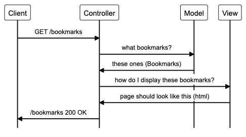
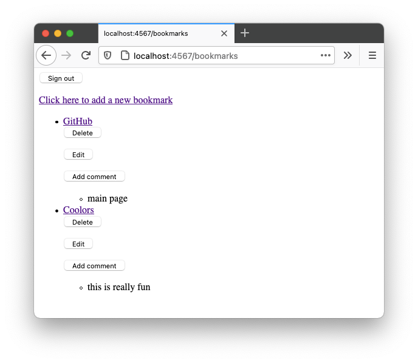
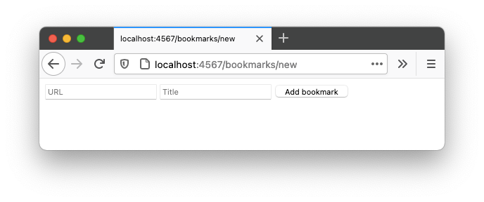

## Bookmarks Manager

A simple bookmarks manager, using the Ruby web framework Sinatra with a PostgreSQL database. Users can save URLs they like for future reference, and also comment on them to easily remember what they're for.

### Description
As part of the [Makers Academy](https://makers.tech) coding bootcamp (week 4 of 12), we were challenged to create a web app to store bookmarks. The majority of this repo was written using alternating pair programming. The other contributors were RTurney and MegGosnell.  

The goal was to learn about databases, SQL, and understand how they fit into the Model-View-Controller pattern.  

We were given these user stories to start with:  

```
As a user
So I can remember what sites I like to visit
I want to see a list of bookmarks
```
```
As a user
So that I can save my favourite sites
I want to be able to add bookmarks to the bookmark manager
```
This diagram shows part of our planning process:


Later on we added registration/authentication, and the ability to add comments to each saved bookmark. Therefore our Models are Bookmark, User, and Comment. The database is PostgreSQL using the pg gem.

### Installation and Usage
To try out the project:
* Make sure Ruby 3.0.0, PostgreSQL and Bundler are installed
* Clone this repo
* Navigate into the cloned folder
* Run `bundle` to install the dependencies

##### To set up the databases:
* Connect to the command line PostgreSQL tool `psql`
* Run `psql`, or `psql postgres` if you haven't set up a database yet
* Run the following commands inside psql to manually create and migrate the databases
```
# Create the databases
CREATE DATABASE bookmark_manager;
CREATE DATABASE bookmark_manager_test;

# Connect to the production database
\c bookmark_manager;
# Run the migration instructions, in order, from the db/migrations/ folder

# Connect to the test database
\c bookmark_manager_test;
# Run the migration instructions again
```
* Quit from psql with `\q`  

##### To run the tests:
* Run `rspec`  

##### To use the app:
* Run `ruby app.rb`
* Go to `localhost:4567` in your browser  

Here are screenshots of the code in action:  




### Known Issues
* The routes aren't linked up correctly, so the session management (signing in and out) doesn't work properly.
