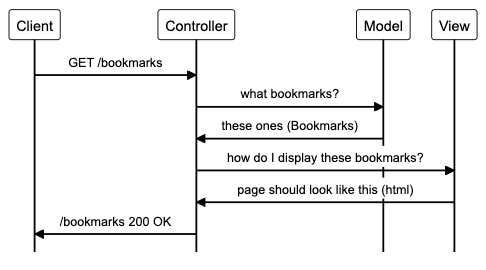

## Bookmarks Manager

First user story:
```
As a user
So I can remember what sites I like to visit
I want to see a list of bookmarks
```
Classes:
Bookmark,  
BookmarkManager (has list of Bookmarks).  
show list -> method of the BookmarkManager



### To set up the database

Make sure that PostgreSQL is installed. Connect to `psql` and create `bookmark_manager` and `bookmark_manager_test` databases:
```
CREATE DATABASE bookmark_manager
CREATE DATABASE bookmark_manager_test
```
Connect to each database and run the SQL scripts in `db/migrations` folder in the given order, to create the right tables.

### To run the app
Run `bundle` to install the required gems. Then run it with:
```
rackup -p 3000 # the -p flag is optional, it specifies which port to use
```
See the bookmarks at `localhost:3000/bookmarks`

### To run tests
Again, make sure `bundle` has been run. Use `rspec` to run the test files.
